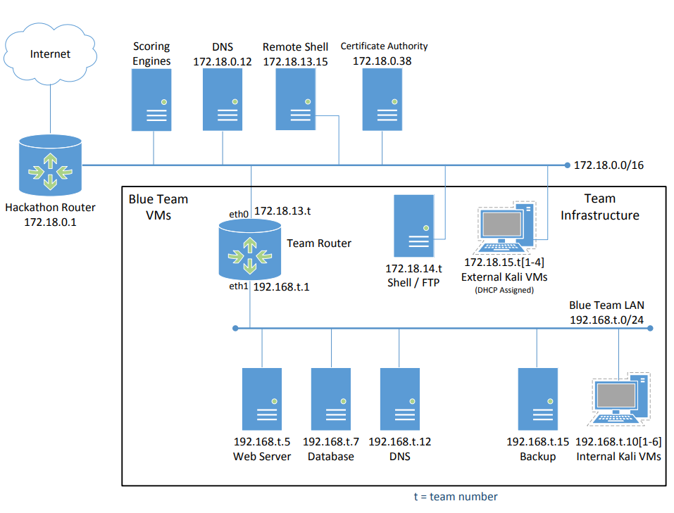

# Linux Maneuvers
Specific techniques worthy of practice. Particularly when it comes to cybersecurity.

## Useful Maneuvers

- Clearing memory caches with [Linux Drop Caches](../Unsorted/Linux%20Drop%20Caches.md)
- `sudo ss -tulnp` → replacement for `netstat` when not available. Makes it easy to find ports/processes/connections which are listening.

## Practice Maneuvers
Techniques players might want to practice for game day.

**SSH**

- SSH Proxying (Port Forwarding)
- Copying files via `scp`
	- recursive option

**Network Security Monitoring**

- Packet Capture
	- Wireshark, etc.
- Packet Analysis
	- Manually...
	- Zeek

**SSL certificate authority**

- Are they providing the certs to us?

## Things that'll need to get done
This list is currently non-exhaustive.

- Int DNS
- Ext DNS
- DB
	- backups
- DNS

Pair those with complementary experiences together. Those who know some of the above with those that know less.

## What Regis is focusing on:

- Setting up logs
	- learning systemd
		- config [systemd-journald](../Unsorted/systemd-journald.md)
		- [systemd-timers](../Unsorted/systemd-timers.md)
	- config [rsyslog](../Unsorted/rsyslog.md)
		- use the **imjournal** module so rsyslog can read journald logs directly, preserving metadata.
	- config them to hide logs in a location deep in the linux filesystem
	- config multiple other locations to send trash logs to.
	- config [logrotate](../Unsorted/logrotate.md) (?)

## Other things we may want to do

- If the desktop environment is available, disable auto-lock?
- Check out that detection script from one of those gitlab repos. There was one that detects users logged into a tty (or something else similar) that shouldn't actually be logged in. We could have a script like that, which would then trigger an alert. If that alert gets triggered, we could perhaps send automatic responses to whatever process/shell that user is running on. Something like spamming out their console with "gitrektgitrektgitrekt", wiping any artifacts they've generated, shutting down their session/connections, etc.
- **Timers**
	- ⭐ How do we prevent manipulation of the system clock?
	- Use systemd timers instead. They're better.
	- Alternatives
		- backup bash / python scripts with similar functionality?
		- is cron actually worth the risk? It has a small attack surface, but could affect the entire system.
	- Set up a timer/trigger → if a certain timer is somehow disabled / turned off, have a trigger go off that would start an emergency backup timer script that could either perform the same function as the timer temporarily, or restore the functionality of the systemd timer.
- **Setup Time**
	- In our first 30-60 mins of setup
		- get scripts copied to local hosts with the clipboard. Wipe the clipboard. Setup encrypted backups of scripts?
- **Misc. Tools that may come into play:**
	- ⭐ tmux. How can we make sure [tmux](../Unsorted/tmux.md) is hardened? In what ways might it be vulnerable?

## Directories worth monitoring

- Logs
- configuration files
- sudo
- passwd
- shadow
- hosts (dns)
- network configurations

## Common Sense

> [!tip]+ Security Best Practices
> Regardless of which system you use, several best practices apply:
> 
> 1. **Principle of least privilege**: Run scheduled tasks with the minimum permissions necessary
> 2. **Comprehensive logging**: Ensure all task outputs are logged and monitored
> 3. **Input validation**: Carefully validate any external inputs used in scheduled tasks
> 4. **Script security**: Use absolute paths, avoid shell expansions when possible, and properly quote variables
> 5. **Regular audits**: Periodically review all scheduled tasks

SSH Log polling

1. Have private key(s) set up on central server
2. Have public keys distributed to individual hosts

# LLM (chatgpt) Context for the Competition
For the duration of this conversation, please keep the following information in mind.

I seek assistance on configuring a particular network environment. This environment is designed for a blue team competition. We are the blue team. The goal is for us, as the blue team, to minimize attack surface, monitor, and prevent threats. We are scored on certain criteria such as the uptime and availability of services with the scoring infrastructure over the course of the 7-hour competition.

The key threat is the red team, who will have pre-configured vulnerabilities and backdoors into our internal network prior to the start of the competition. We'll be at risk of unauthorized access, malware, lateral movement, privesc, and potentially DoS. We currently are unaware of the full breadth of threats we'll be subject to. Aside from the provided scope, there are no compliance / competition rules restricting certain actions.

I MIGHT have attached an image of the network topology, but may not have. Regardless, here are other crucial details:

**Our Team Number**
- ⭐ We are team number: 56
	- Within the IP addresses listed below, please replace instances of the variable "t" with our team number.

**Other Details:**
- The environment is hosted on a proxmox server we will be cloud-connected to. All endpoints are hosted on this proxmox instance.
- We have noVNC access to all hosts.
- We have SPICE access to all hosts except the Microtik Router.
- "t" in the screenshot is a variable representing our team number, which will comprise some of our network/host addresses. .
- IPv6 is likely to be unused. We will likely disable it if so.
- We will have access to the external internet via the link between the Microtik and Hackathon routers. It has a max bandwidth of 25Mb. The route to the external internet would have to be manually set up.
- It might not be possible to remediate vulnerable hosts with the regular channels (official updates, etc). Even with an external network connection, out-of-date hosts could reject updates if there is no secure way to download packages.
- We will only have 30 minutes to 1 hour to setup the hosts at the start of the competition.
- The first half of the competition lasts for 3 hours—there is then an hour lunch break—then the second half of the competition lasts for another 3 hours.
- We have to manually configure network settings/IPs/routes ourselves.
- We only are allowed to control the hosts/endpoints listed here.
- **Endpoints in our control:**
	- **Both Sides**
		- **Default Gateway/Team Router**: is a Microtik Router - RouterOS version 7.17.1.
			- Network interfaces
				- eth0: 172.18.13.t (external)
				- eth1: 192.168.t.1 (internal)
	- **External Network** (IP range 172.18.0.0/16)
		- External Kali VM:
			- IP: 172.18.15.t
			- OS: Kali version 2021.1
		- Shell / FTP VM:
			- IP: 172.18.14.t
			- OS: UNKNOWN Linux Distro
			- Services: UNKNOWN.
	- **Internal Network** (IP range 192.168.t.0/24)
		- Internal Kali VM:
			- IP: 192.168.t.10
			- OS: Kali version 2021.1
		- Web Server:
			- IP: 192.168.t.5
			- OS: UNKNOWN Linux Distro, but possibly Ubuntu LTS Focal Fossa.
			- Services: UNKNOWN web server service. nginx, and apache2 are possibilities, but we are unsure.
		- Database:
			- IP: 192.168.t.7
			- OS: UNKNOWN Linux Distro
			- Services: UNKNOWN. Could be MySQL, PostgreSQL, flask, etc. Not sure.
		- DNS:
			- IP: 192.168.t.12
			- OS: UNKNOWN Linux Distro
			- Services: UNKNOWN. Likelist DNS server is bind.
		- Backup Server:
			- IP: 192.168.t.15
			- OS: UNKNOWN Linux Distro
			- Services: UNKNOWN
- **Black Team Endpoints**
	- **External Network** (IP range 172.18.0.0/16)
		- Scoring Engines
			- Nothing else known.
		- DNS
			- IP: 172.18.0.12
			- Nothing else known.
		- Remote Shell
			- IP: 172.18.13.15
			- Nothing else known.
		- Certificate Authority
			- IP: 172.18.0.38
			- Nothing else known.
		- Blue Team Jumphost
			- Nothing else known, but we will be allowed to `ssh` into our internal network through our local (physical) machines.
		- There could be other hosts managed by the Black Team here now that are a part of the competition, but we have not been given this information.

Thank you for your consideration. I deeply appreciate your efforts!

---

How to flush dns on linux?